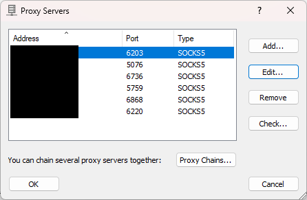
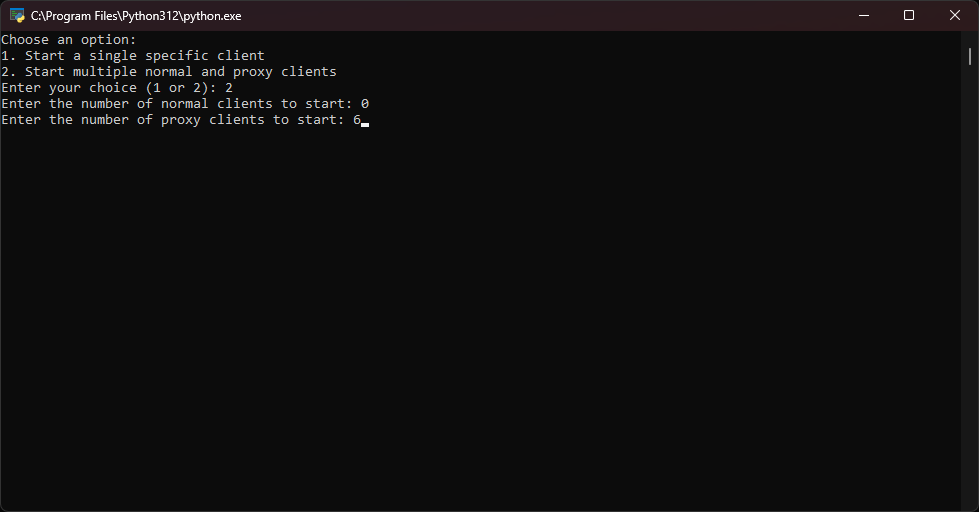
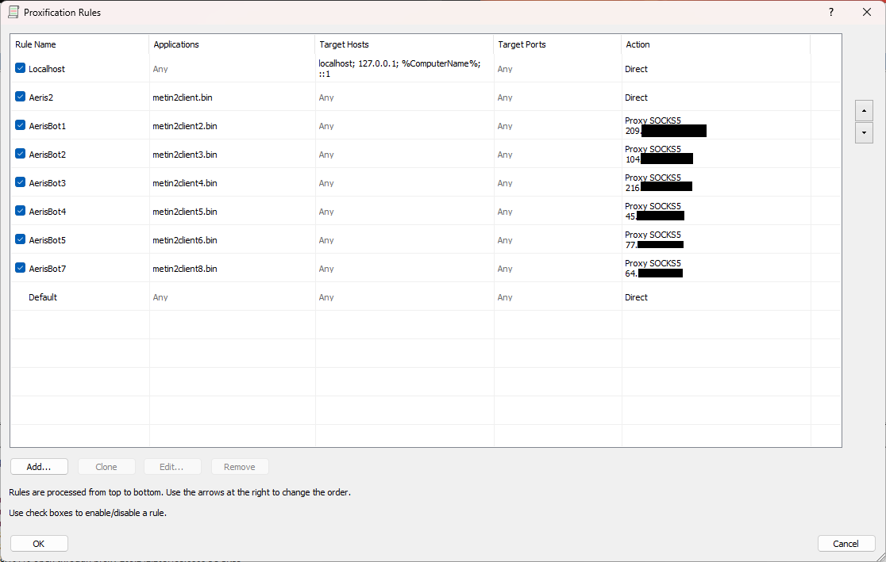

# Instrukcja: Uruchamianie wielu klientów Metin2 przez proxy

W tym poradniku pokażę, jak uruchomić wielu klientów Metin2 przez różne serwery proxy. 

## Krok 1: Znalezienie proxy
Pierwszym krokiem jest znalezienie proxy. Może być darmowe, ale polecam zainwestować w płatne, aby uzyskać lepszą jakość połączenia. Ja osobiście używam [Proxy Webshare](https://proxy2.webshare.io/).

## Krok 2: Pobranie programu do uruchamiania aplikacji przez proxy
Następnym krokiem jest pobranie programu do uruchamiania aplikacji przez proxy. Istnieje wiele opcji, ale ja używam Proxifier. Program jest płatny, jednak tutaj znajdziesz [klucze do pełnej wersji](https://gist.github.com/montasim/11e313f82dc6c2aea28298941158429f).

### Konfiguracja Proxifier:
1. Otwórz Proxifier.
2. Kliknij **Profile > Proxy Servers**.
3. Dodaj swoje proxy (pamiętaj, że musisz mieć osobne proxy dla każdego klienta).


## Krok 3: Uruchomienie skryptu do tworzenia plików startowych
Potrzebny będzie skrypt, który stworzy osobne pliki startowe do Metina. Wykonaj poniższe kroki:

1. Pobierz skrypt i otwórz go w edytorze tekstu (np. Notepad).
2. Zmień zmienną `WORKING_DIR` na ścieżkę, gdzie masz zainstalowanego Metina.
3. Uruchom skrypt jako administrator (upewnij się, że masz zainstalowanego Pythona).
4. Gdy skrypt się uruchomi, wybierz opcję `2`, aby uruchomić wiele klientów.
5. W pierwszej opcji wybierz `0`, a następnie wpisz liczbę klientów, jakich chcesz używać.
6. Po uruchomieniu klientów, zamknij wszystkie okna klientów.


### Wymagane pakiety Python:
Aby skrypt działał poprawnie, musisz upewnić się, że masz zainstalowane następujące pakiety:

- **Standardowe pakiety Python** (instalowane automatycznie z Pythonem):
  - `subprocess`
  - `os`
  - `time`
  - `logging`

- **Pakiety zewnętrzne (musisz je zainstalować)**:
  - `pyuac`
  - `psutil`

Aby zainstalować te pakiety, możesz użyć poniższej komendy w terminalu:

```bash
pip install pyuac psutil
```

## Krok 4: Przypisywanie klientów do proxy w Proxifier
Aby każdy klient działał na osobnym proxy, wykonaj poniższe kroki:

1. W Proxifier kliknij **Profile > Proxification Rules**.
2. Przypisz każdy plik `metin2.client.bin` do innego proxy.
3. Zatwierdź ustawienia klikając **OK**.


## Krok 5: Uruchamianie wielu klientów
Teraz, gdy wszystko jest skonfigurowane, ponownie uruchom skrypt, wybierz liczbę klientów, których chcesz używać. Każdy klient powinien działać na osobnym proxy.

## Dodatkowa informacja

Jeśli któryś z klientów zostanie wyrzucony (rozłączony), możesz użyć skryptu, aby uruchomić tylko tego jednego klienta:

1. Uruchom skrypt i wybierz pierwszą opcję.
2. Wybierz pierwszy klient, który nie jest jeszcze uruchomiony ('1' zawsze odpala sie bez proxy na twoim ip).

Dzięki temu nie musisz zamykać wszystkich klientów i możesz szybko wznowić działanie jednego z nich.


Gotowe! Powinieneś być teraz w stanie uruchomić wielu klientów Metin2, każdy przez inne proxy.

---

Powodzenia!
